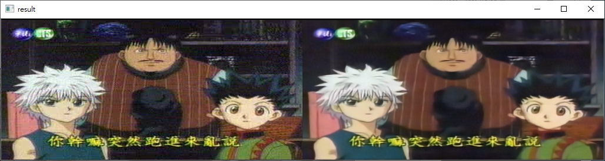
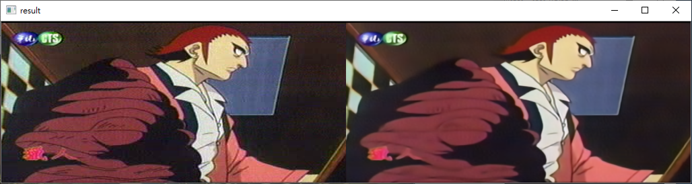

# noise2noise_video_test

Input video to verification framework "noise2noise".

## Dependencies
- python == 3.6
- tensorflow == 2.4.0
- Keras >= 2.1.2, TensorFlow, NumPy, OpenCV

## Instructions

驗證模型去除高資雜訊的能力，使用 [1] https://github.com/yu4u/noise2noise 此篇程式碼訓練模型，使用該篇作者的數據集進行訓練。

程式碼可以輸入圖片以及影片，預設為影片去除高斯雜訊，若要改成輸入圖片可以從程式碼裡註解以及修改註解。

額外加入圖片放到imagedir資料夾、影片放到目錄下修改路徑執行。

以下為該篇架構訓練指令:

```bash
python train.py --image_dir dataset/291 --test_dir dataset/Set14 --image_size 128 --batch_size 4 --lr 0.001 --output_path gaussian001 --nb_epoch 100 --step 85 --source_noise_model gaussian,25,25 --target_noise_model gaussian,25,25 --val_noise_model gaussian,25,25
```

##Result




## References

[1] https://github.com/yu4u/noise2noise
